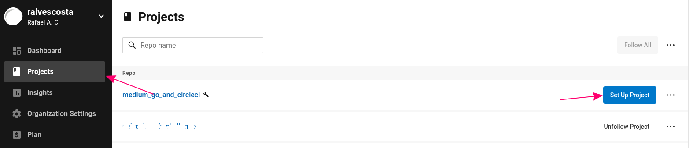
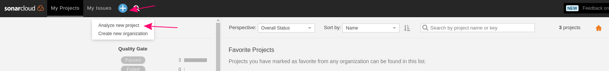

# How to configure CircleCI for GoLang Application

[](https://circleci.com/gh/ralvescosta/medium_go_and_circleci/tree/main)
[](https://sonarcloud.io/summary/new_code?id=ralvescosta_medium_go_and_circleci)

[**In progress**]

## Table of contents

- [Introduction](#introduction)
- [Initial Configuration](#initial-configuration)
- [Build Job](#build-job)
- [Lint Job](#lint-job)
- [Test and coverage Job](#test-and-coverage-job)
- [SonarCloud Job](#sonarcloud-job)
- [Conclusion](conclusion)


## Introduction

One of the impotent thing in our projects is the CI process. Continuous Integration (CI) is the practice of automating the integration of code changes and guarantee the quality of the software. If CI is so important, why we don't configure this process in our personal projects? Maybe because we thing is so harder to configure or even it's take so much time. In this post I'm going to show you a simple way to configure a strong CI process using some of the best tools for that, [CircleCI](https://circleci.com/) and [SonarQuebe](https://sonarcloud.io/).

For this post we are configure a CI for a simple GoLang application creating a multistage CI, each stage we called Job, in the end of this post we're going to have four jobs: **Lint**, **Test and Coverage**, **Quality Analises with SonarQuebe** and **Build**. The proposal where is to explain the CI not build a GoLang application so we assume you already know the GoLang basics and some tools [Test Pkg](https://pkg.go.dev/cmd/go/internal/test), [GolangCI Lint](https://golangci-lint.run/) also the basics about Github and Github Actions.

The project that was built can be found in [this repository](https://github.com/ralvescosta/medium_go_and_circleci).

## Initial Configurations

First we need to create a yaml file to configure our CI processes, for CircleCI this file need to be create in a specific directory:

```bash
make .circleci

touch .circleci/config.yml
```

We start our config.yml like this:

```yml
version: 2.1

jobs:
  - job_name

workflows:
  - workflow_name
      jobs:
        - job_name
```

We can see two main tags: 'jobs' and 'workflows'. Basically the tag 'jobs' we define the job execution flow and in the 'workflows' how to execute the 'jobs'. Let's start with the build job:

## Build Job

```yml
version: 2.1

jobs:
  build:
    working_directory: ~/repo
    docker:
      - image: circleci/golang:1.17
    steps:
      - checkout
      - restore_cache:
          keys:
            - go-mod-v4-{{ checksum "go.sum" }}

      - run:
          name: Install Dependencies
          command: go mod download
      - save_cache:
          key: go-mod-v4-{{ checksum "go.sum" }}
          paths:
            - "/go/pkg/mod"

      - run:
          name: Run build
          command: |
            mkdir -p /tmp/artifacts/build
            go build -ldflags "-s -w" -o exec main.go
            mv exec /tmp/artifacts/build
      - store_artifacts:
          path: /tmp/artifacts/build

workflows:
  ci:
    jobs:
      - build
```

This job is self explanatory basically we downloaded the project packages and build our project. With this job we can run our first pipeline, but first we need to publish the config.yml in the repository and then we need to configure our project in CircleCi Projects.



At this time the CircleCi will run for the first time our pipeline 🚀🚀.

## Lint Job

Now let's create our lint job

```yml
jobs:
  lint:
    working_directory: ~/repo
    docker:
      - image: golangci/golangci-lint:v1.45
    steps:
      - checkout
      - run: golangci-lint run ./... --out-format=checkstyle --print-issued-lines=false --print-linter-name=false --issues-exit-code=0 --enable=revive > golanci-report.xml
      - persist_to_workspace:
          root: ~/repo
          paths:
            - golanci-report.xml
```

For lint we used the [GolangCI Lint](https://golangci-lint.run/) but we have some configurations to do, how you can see the golangci-lint execution has a bunch of arguments, let's talk about that. The first argument '--out-format' needed to be 'checkstyle' for integrate better with sonar. Other flag importante to talk about is --issues-exit-code=0, we need to configure this flag with 0 because whe golangci execute and found something wrong in our project the executor will finish with exit code igual 1 and when our pipeline receives this result it failure, to avoid the pipeline failure and get the report to send for the sonar we needed to change the flag --issues-exit-code. Before the runner we have a step to persiste the report file in a path to allowed others job to access it.

For this point we can now configure our workflows with theses jobs:

```yml
workflows:
  ci:
    jobs:
      - lint
      - build
        - requires:
            - lint

```

In our workflows we can see something diferente, it's because we wanted the build job execute only after the lint job finished their execution.

## Test and coverage Job

```yml
jobs:
  test_and_coverage:
    working_directory: ~/repo
    docker:
      - image: circleci/golang:1.17
    steps:
      - checkout
      - restore_cache:
          keys:
            - go-mod-v4-{{ checksum "go.sum" }}

      - run:
          name: Install Dependencies
          command: go mod download
      - save_cache:
          key: go-mod-v4-{{ checksum "go.sum" }}
          paths:
            - "/go/pkg/mod"

      - run:
          name: Run unit tests
          command: |
            mkdir -p /tmp/test-reports
            gotestsum --junitfile /tmp/test-reports/unit-tests.xml
      - store_test_results:
          path: /tmp/test-reports

      - run:
          name: Run coverage
          command: |
            go test ./... -race -coverprofile=coverage.out -json > report.json
      - persist_to_workspace:
          root: ~/repo
          paths:
            - coverage.out
            - report.json
```

That job is a quite equal than the others, we has thee runners, the first to get the golang pkgs, the second one to run the unit tests and the last one to run the coverage. Now our workflows looks like:

```yml
workflows:
  ci:
    jobs:
      - lint
      - test_and_coverage
      - build
        - requires:
            - lint
            - test_and_coverage
```

## SonarCloud Job

SonarCloud is a platform how offer the SonarQuebe as a service, SonarQuebe is a multi-language tool that analyzes our code base in search of bugs, vulnerabilities, code smells and returns quality indicators. To integrate CircleCI with the SonarCloud platform we going to use a powerful tool in CircleCI called Orbs, you can found more about [Orbs here](https://circleci.com/orbs/?utm_source=google&utm_medium=sem&utm_campaign=sem-google-dg--latam-en-brandAuth-maxConv-auth-brand&utm_term=g_e-circleci%20orbs_c__commandsSU_20200730&utm_content=sem-google-dg--latam-en-brandAuth-maxConv-auth-brand_keyword-text_eta-circleCIOrbs_mixed-&gclid=CjwKCAjwoduRBhA4EiwACL5RP5bwGA_CGCL_q0FQfMWfvXT6KPnXgCjSWlIOOixwC_3XoQCgTdX9rhoCb4kQAvD_BwE). To use orbs you need to allowed your organization to used it. Go to Organization Settings > Security and allowed orbs.

First of all we need to create and account in SonarCloud and before we need to add our public repository to be analyzed by sonar. 



Before that sonar will get you two importante things your **projectKey** and **SONAR_TOKEN** don't lose than. The next thing to do is create our **sonar-project-properties** file, this file contains our sonar scanner configuration to configure sonar to do everting we want.

```toml
# =====================================================
#   Standard properties
# =====================================================

sonar.projectKey=YOUR_SONAR_PROJECT_KEY
sonar.organization=YOUR_SONAR_ORGANIZATION
sonar.projectVersion=1.0

sonar.sources=pkg
sonar.exclusions=**/*_test.go,**/vendor/**
 
sonar.tests=pkg
sonar.test.inclusions=**/*_test.go
sonar.test.exclusions=**/vendor/**

# =====================================================
#   Meta-data for the project
# =====================================================

sonar.links.homepage=YOUR_PUBLIC_REPOSITORY_URL
# sonar.links.ci=
sonar.links.scm=YOUR_PUBLIC_REPOSITORY_URL
sonar.links.issue=YOUR_PUBLIC_REPOSITORY_URL/issues

# =====================================================
#   Properties specific to Go
# =====================================================

sonar.go.gometalinter.reportPaths=golanci-report.xml
# sonar.go.govet.reportPaths=govet-report.out
# sonar.go.golint.reportPaths=golint-report.out
sonar.go.tests.reportPaths=report.json
sonar.go.coverage.reportPaths=coverage.out
```

The last configuration is register our SONAR_TOKEN into the our CircleCI project. To do that navigate through our CircleCI project, going to the Project Configurations > Environment Variable and add the SONAR_TOKEN. With all of this steps done we can write our SonarCloud Job.

```yml
jobs:
  sonar:
    working_directory: ~/repo
    docker:
      - image: circleci/golang:1.17
    steps:
      - checkout
      - attach_workspace:
          at: ~/repo

      - sonarcloud/scan:
          sonar_token_variable_name: SONAR_TOKEN

orbs:
  sonarcloud: sonarsource/sonarcloud@1.0.3
```

We can merge all of this jobs in our config.yml and get our beautiful pipeline.

```yml
version: 2.1

jobs:
  lint:
    working_directory: ~/repo
    docker:
      - image: golangci/golangci-lint:v1.45
    steps:
      - checkout
      - run: golangci-lint run ./... --out-format=checkstyle --print-issued-lines=false --print-linter-name=false --issues-exit-code=0 --enable=revive > golanci-report.xml
      - persist_to_workspace:
          root: ~/repo
          paths: 
            - golanci-report.xml

  test_and_coverage:
    working_directory: ~/repo
    docker:
      - image: circleci/golang:1.17
    steps:
      - checkout
      - restore_cache:
          keys:
            - go-mod-v4-{{ checksum "go.sum" }}

      - run:
          name: Install Dependencies
          command: go mod download

      - save_cache:
          key: go-mod-v4-{{ checksum "go.sum" }}
          paths:
            - "/go/pkg/mod"

      - run:
          name: Run unit tests
          command: |
            mkdir -p /tmp/test-reports
            gotestsum --junitfile /tmp/test-reports/unit-tests.xml
      - store_test_results:
          path: /tmp/test-reports

      - run:
          name: Run coverage
          command: |
            go test ./... -race -coverprofile=coverage.out -json > report.json
      - persist_to_workspace:
          root: ~/repo
          paths: 
            - coverage.out
            - report.json

  sonar:
    working_directory: ~/repo
    docker:
      - image: circleci/golang:1.17
    steps:
      - checkout
      - attach_workspace:
          at: ~/repo

      - sonarcloud/scan:
          sonar_token_variable_name: SONAR_TOKEN

  build:
    working_directory: ~/repo
    docker:
      - image: circleci/golang:1.17
    steps:
      - checkout
      - restore_cache:
          keys:
            - go-mod-v4-{{ checksum "go.sum" }}

      - run:
          name: Install Dependencies
          command: go mod download

      - save_cache:
          key: go-mod-v4-{{ checksum "go.sum" }}
          paths:
            - "/go/pkg/mod"

      - run:
          name: Run build
          command: |
            mkdir -p /tmp/artifacts/build
            go build -ldflags "-s -w" -o exec main.go
            mv exec /tmp/artifacts/build
      - store_artifacts:
          path: /tmp/artifacts/build

orbs:
  sonarcloud: sonarsource/sonarcloud@1.0.3

workflows:
  ci:
    jobs:
      - lint
      - test_and_coverage
      - sonar:
          requires:
            - lint
            - test_and_coverage
      - build:
          requires:
            - sonar
```

## Conclusion